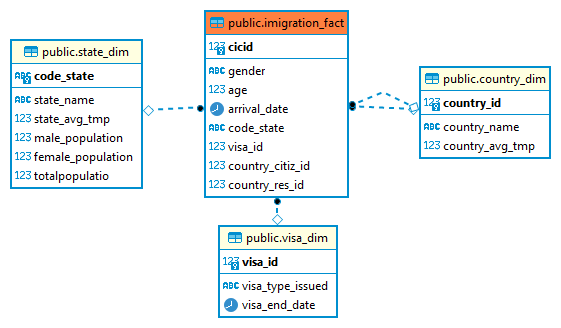
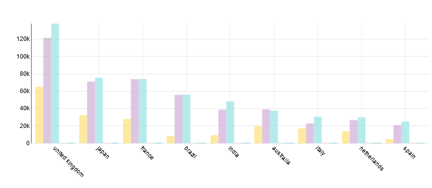
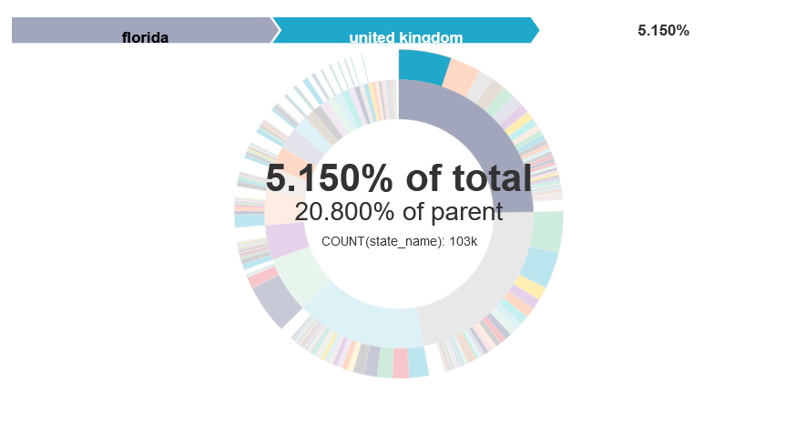

# Project: Data Engineering Capstone Project

------------------------------------------
### Purpose of project

this project aims to find patterns and answers to questions such as what is the the most favorit state in us for immigrant ,if thre is a pattern between originale country and destitnation state (for temperatures) ...

--------------------------------------------
### Databaase schema
The following diagram show the star schema used in this project

   

##### imigration_fact table : 

| Column | Description |
| :- | :- |
| cicid | unique id|
| gender | individual gender |
| age | individual age |
| arrival_date | arrivale date to usa |
| code_state | usa state distination |
| visa_id | unique visa id auto generated from the combination of visa type and visa end date |
| country_citiz_id | country of citizenship |
| country_res_id | country of residence |

##### visa_dim table :

| Column | Description |
| :- | :- |
| visa_id | unique visa id auto generated from the combination of visa type and visa end date |
| visa_type_issued | the type of vissa issued: Business Pleasure Student|
| visa_end_date | visa end date |
 
##### state_dim table : 

| Column | Description |
| :- | :- |
| code_state | USA code of the state  |
| state_name | USA state full name  |
| state_avg_tmp | the average temperature in the State |
| male_population | population size grouped by male  |
| female_population | population size grouped by female   |
| totalPopulatio | totale population size |

##### country_dim table : 

| Column | Description |
| :- | :- |
| country_id | couontry code from SAS description |
| country_name | full country name  |
| country_avg_tmp |  the average temperature in the country  |

--------------------------------------------
### Project Structure 
In addition data files, this project includes the following files:
+ `Capstone Project Template.ipynb` - a python notebook that contain all steps of this project
+ `sql_queries.py` - this python file contain all database querys ;
+ `etl_create_and_drop_tables.py` - This script is our ETL script which will allow to create tables in our DWH database;
+ `resources.txt` - Contain most of the websites i have used to complete this project;
+ `config.cfg` - Contain database configuration 

### Running procedure

fisrt of all make sure to copy all data files used to HDFS cluster and change database config file `config.cfg` then run the  etl_create_and_drop_tables.py to create tables in database after taht we can run the python notebook `Capstone Project Template.ipynb`.

### result visualization
finally using a data exploration software like apache supperset who help us to create a great visualisation : 

